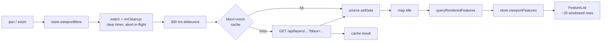

# Architecture

The technical brief: a guided tour of the six decisions that carry most of this codebase, each section stating the choice, the reasoning, and the trade-off accepted, with file paths throughout. The six: every layer reaches the browser in one normalized GeoJSON contract; datasets are precomputed and committed rather than proxied live; one Pinia store is the only channel between components while MapLibre stays imperative; viewport fetches are debounced, aborted, and cached; the buildings layer is parked at the GeoJSON ceiling on purpose; and failure is a per-source state, not a global one. [NOTES.md](NOTES.md) records the same system problem by problem, [DATA.md](DATA.md) is the data-pipeline reference, and [TRAPS.md](TRAPS.md) is the Vue/Nuxt patterns catalogue; this file is the decision-level read.

## One GeoJSON contract, normalized in the backend

Each upstream source gets exactly one backend module ([backend/lib/backend/weather.ex](backend/lib/backend/weather.ex), [backend/lib/backend/land_price.ex](backend/lib/backend/land_price.ex), [backend/lib/backend/buildings.ex](backend/lib/backend/buildings.ex)) that emits a GeoJSON `FeatureCollection` with a documented `properties` contract. The frontend never sees a raw upstream shape: [frontend/app/components/MapView.client.vue](frontend/app/components/MapView.client.vue) fetches each layer and hands it straight to MapLibre with zero reshaping. The starkest example is land price: the raw 8 MB MLIT file is committed unchanged, and `Backend.LandPrice` maps its opaque coded fields (`L01_006` to `price_per_sqm`, `L01_024` to `address`) at serve time while dropping the ~134 fields the app does not use. The exact mappings are in [DATA.md §2](DATA.md).

The reasoning is that upstream quirks should each be isolated in one place: MLIT's coded fields, Open-Meteo being per-point JSON that is not geospatial at all, Overpass emitting `{lat, lon}` objects where GeoJSON wants `[lon, lat]` arrays. Adding a fourth source means one new module emitting the same contract; nothing on the frontend changes but a URL. All three modules share [backend/lib/backend/geojson_file.ex](backend/lib/backend/geojson_file.ex), which parses and transforms once and caches in `:persistent_term` keyed by file mtime, so editing a data file shows up on the next request without a restart. The trade-off accepted: the server holds parsed collections in memory and re-normalizes on every file change, which is fine at 8 MB and would need rethinking with real data volumes, and there is no database at all, so anything requiring persistence is out of scope by construction.

## Precomputed data, not live proxying

Nothing is fetched from an upstream API at request time. Weather is a committed climatology: [backend/priv/data/weather_summer_avg.ingest.mjs](backend/priv/data/weather_summer_avg.ingest.mjs) builds a 139-point mainland-Tokyo grid (latitude step scaled by cos of the mean latitude so points are equally spaced in screen pixels), clips it to the Tokyo polygon by ray casting, averages the 2022-2024 summer daily means from Open-Meteo's archive API, then renders a 512x256 IDW raster PNG using only Node's built-in zlib. Buildings come from a one-off Overpass ingest ([backend/priv/data/buildings.ingest.mjs](backend/priv/data/buildings.ingest.mjs)) and land price from a bulk MLIT download; all three artifacts are committed under [backend/priv/data/](backend/priv/data).

Two reasons. First, live Tokyo current-temperature has roughly a 1°C spread across the whole city, which is not worth displaying, and the free tier rate-limits a 139-point grid fetch; a stable climatology is more representative and never 502s during a demo. Second, serving the weather as a pre-rendered `image` source instead of styled circles gives a continuous temperature field at every zoom, where the earlier blurred-circle approach showed discrete dot artefacts. The trade-off accepted: the data is stale by design (2023 land prices, a three-summer average), and the "what if the upstream is slow or down" lesson that live proxying would have taught is preserved deliberately through fault injection instead (last section). The ingest scripts are committed and re-runnable, so refreshing the data is a command, not an archaeology project.

## One Pinia store; MapLibre stays imperative

All shared query state lives in a single Pinia store, [frontend/app/stores/query.ts](frontend/app/stores/query.ts): layer toggles, the price-filter bounds, the current viewport bbox, the features visible in the viewport, and the weather fault/status/retry state. [ControlPanel.vue](frontend/app/components/ControlPanel.vue) writes it, [MapView.client.vue](frontend/app/components/MapView.client.vue) watches it and applies changes imperatively (`setLayoutProperty` for visibility, `setFilter` for the price range, `setData` for new data), and [FeatureList.vue](frontend/app/components/FeatureList.vue) reads it. The three components are siblings with zero props or events between them.

The map instance itself is deliberately outside Vue's reactivity: a plain closure variable, never a `ref` or `reactive`, because wrapping a WebGL map in a Vue proxy serves no purpose and tanks performance ([TRAPS.md](TRAPS.md) trap #6, and the store wiring is trap #1's `storeToRefs` case). The trade-off accepted: MapView carries explicit `watch` wiring instead of declarative bindings, which makes it the biggest file in the frontend. A wrapper library would hide exactly the store-to-imperative-API boundary this project exists to learn, so the verbosity is the point.

## Viewport fetches are debounced, aborted, and cached

Every `moveend` writes the bbox to the store, and a `watch` in [MapView.client.vue](frontend/app/components/MapView.client.vue) turns that into a disciplined fetch: a 300 ms debounce (longer than a pan flick, shorter than feels laggy), an `AbortController` for the in-flight request, and an in-memory cache keyed by the bbox rounded to 0.1 degrees (~11 km at Tokyo) plus floored zoom. The `onCleanup` hook cancels both the timer and the request whenever the bbox changes again, so no stale response ever reaches a map that has moved on. The same pattern appears twice, for land price and buildings, because seeing it twice is the point: it is the standard shape of any expensive per-viewport query. The backend does its half by bbox-filtering the memoized collection ([backend/lib/backend/land_price.ex](backend/lib/backend/land_price.ex), [backend/lib/backend/buildings.ex](backend/lib/backend/buildings.ex)).

Filtering costs even less than a cached fetch: the price range is applied with MapLibre `setFilter`, a render-time expression, so moving the slider hides and shows points with no data round-trip at all. The synced list is populated from `queryRenderedFeatures`, which already respects the active filter, but only after the next `render`/`idle` event, because `setFilter` and `setData` take effect on the next paint, not synchronously ([NOTES.md §6](NOTES.md)). The trade-off accepted: the coarse cache key trades freshness for hit rate, and the cache is an unbounded `Map`. Its known limit: no LRU and no TTL, acceptable for a session-length demo, not for a long-lived tab.

## The buildings layer is parked at the GeoJSON ceiling

The buildings layer exists to make "when does GeoJSON stop scaling" a measured fact instead of a slogan. The first ingest run against a broad central-Tokyo bbox returned 206,971 polygon features, roughly 150 MB of GeoJSON, which would freeze the main thread on `setData` even fully cached. The response was to design around the ceiling: [buildings.ingest.mjs](backend/priv/data/buildings.ingest.mjs) narrows to the Shinjuku-core bbox and caps at 8,000 features, the layer ships off by default so the initial load stays fast and toggling it on lets you feel the parse cost, and the frontend fetches it per viewport with the same debounce-abort-cache pattern rather than loading the file whole. The full story is in [DATA.md §3](DATA.md) and [NOTES.md §3](NOTES.md).

At 8k features a `geojson` source still works, and that is precisely why the layer is sized there: large enough to demonstrate the concern, small enough to keep the demo snappy. The trade-off accepted: coverage is one ward's core, not Tokyo. The full-scale path is named rather than built: run tippecanoe over the uncapped dataset, serve PMTiles, switch the MapLibre source type to `vector`, and nothing else on the frontend changes. Its known limit: `fill-extrusion` (3D buildings) is prepared for, with `height` and `levels` carried in the properties contract, but not implemented.

## Failure is a per-source state, not a global one

The weather endpoints accept `?fault=error|delay` ([backend/lib/backend_web/controllers/weather_controller.ex](backend/lib/backend_web/controllers/weather_controller.ex)): `error` returns an immediate 502, `delay` sleeps 3 seconds first, so the UI's failure handling can be demonstrated live instead of hypothetically. On the frontend, status is per source: [query.ts](frontend/app/stores/query.ts) holds `weatherStatus`, `weatherFault`, and a retry tick, [ControlPanel.vue](frontend/app/components/ControlPanel.vue) shows a status dot and a retry button that appears only on error, and a failed weather fetch resets the raster to a transparent 1x1 placeholder so the error is unambiguous at a glance rather than masked by stale imagery. Meanwhile the land-price layer, the list, and the price filter keep working untouched, which is the correct model for a dashboard fed by multiple independent sources.

The reasoning for query-param injection over a server-side fault flag: it needs no extra state or round-trip, and the mechanism is visible in the network tab, which suits a learning repo. The trade-off accepted: a real client would not know about its backend's fault modes. Its known limit: only the weather source gets the full status-dot-and-retry treatment; land-price and buildings failures are caught (each fetch is wrapped so a failing source can never break the map) but surface only as an empty layer and a console warning, and there is no automated test coverage beyond the Phoenix scaffold, consistent with the repo's stated non-goals ([README.md](README.md) § Explicit non-goals).
